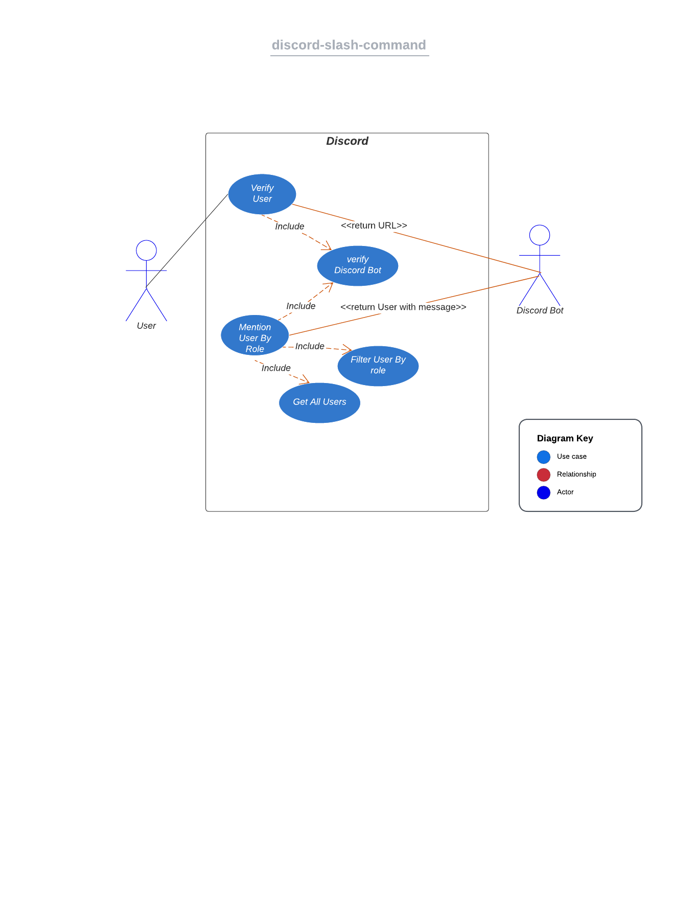

# Contributing to Real Dev Squad Discord Bot

- [Getting Started](#getting-started)
- [Setting Up Local Development](#setting-up-local-development)

## Getting Started

To contribute to this project, you have to set up few things first.

- Create an account on Cloudfare Workers and Discord if you don't already have one
- Create a personal discord server
- Fork and clone this repo (this is optional; if you are a member of RDS community, you don't have to fork)
- Install volta - this will check if you have the right node version or not
- Create a .env file in the root directory of the project

Next, you need to gather few details that will be crucial for setting up your local environment. The IDs that you will gather in the next steps, will be stored as secret keys on the Cloudfare workers platform, where the application will be hosted.

- To get the guild ID of your server :
  - Open your discord server
  - Click on the server name in the top-left corner
  - Click on Server Settings
  - Click on the Widget tab in the side panel
  - Copy/paste the Server ID in the .env file as `DISCORD_GUILD_ID`
- Visit [Discord Developer Portal](https://discord.com/developers/applications)
- Click on new application.
- Under the General Information panel
  - copy/paste the Application ID in the .env file as `DISCORD_APPLICATION_ID`
  - copy/paste the Public Key in the .env file as `DISCORD_PUBLIC_KEY`

Next, you need to create your own bot. The idea here is that you will have your own bot that can be used to run all commands in your private server. You can add new features and test it there to make sure everything works as expected, before deploying the code on production.

- To create a bot, go to the Bot panel and click on 'Add Bot'
- Next, copy the token from the dashboard there and save it in the .env file as `DISCORD_TOKEN `.
- Next, you have to generate a set of RSA keys 2048 bit in size. We will use them as `BOT_PRIVATE_KEY` and `BOT_PUBLIC_KEY`.

  - You can read more about RSA keys [here](https://www.namecheap.com/support/knowledgebase/article.aspx/798/69/what-is-an-rsa-key-used-for/)
  - All you need to know for now is that the private and public keys are used when authenticating using JWT.
  - You can generate your own keys for local development [here](https://cryptotools.net/rsagen)

- Navigate to OAuth2 > URL Generator
  - In scopes select `bot` and `applications.commands`
  - In Bot Permissions select
    - Manage Roles
    - Change Nickname
    - Manage Nicknames
    - Send messages
    - Create public threads
    - Create private threads
    - Send message in threads
    - Embed links
    - Mention Everyone
    - Use slash commands

After providing all the permissions, a URL will be generated below.

- Copy/paste this URL in a new browser window
- Select your private server from the dropdown and authorize
- This will invite the bot to your private discord server

## Setting Up Local Development

- run `npm install`
- Now, run the command `npm run register` - this will register all the commands to your discord bot.

Next you will have to set up the wrangler cli, so that you can connect to your cloudflare workers account.

- run `npx wrangler login` -> You will be prompted to authenticate your account, after which you will see a 'successfully logged in' message in your terminal
- For a sanity check, run `npx wrangler whoami` -> You will then see your account name and account id in the terminal

- Run the command `npx wrangler publish`
- Go to Your cloudflare `dashboard > workers > discord-slash-commands > settings > variables > edit Variables`
- Now add following variables to your environment:

  - `BOT_PRIVATE_KEY`
  - `DISCORD_GUILD_ID`
  - `DISCORD_PUBLIC_KEY`
  - `DISCORD_TOKEN`

- Now, start the local server with the command `npm start`- make sure it is running on port `8787`
- Open another terminal and type in the command `npm run ngrok`.
- `ngrok` creates a secure tunnel that allows a local server to connect to external clients. It provides a URL that can be used to connect to a local server, just like if it were a public server hosted somewhere. For eg: Say you're running your app on `http://127.0.0.1:5501/` i.e localhost port 5501. Any external applications cannot connect to this server by default, but `ngrok` will give you a `http(s)` URL that any other client can use to connect to this server.
- You will see 2 URLs generated, copy the `https` URL (eg: https://765m-321-132-44-44-44.ngrok.io)
- Now, go to [Discord Developer Portal](https://discord.com/developers/applications) and select your bot
  - In the General Information, paste the link in the `INTERACTIONS ENDPOINT URL` field.

To verify if your bot is working:

- Go to the server where your bot was invited
- run a /hello command and the bot should reply with `Hello <Your_username>`

Now add the public key in `rds-backend`

- Go to `local.js` in config
- Create following there

```
botToken:{
  botPublicKey:<Public key generated in the format similar to development.js>
}
```

- Start the rds backend
- Open a new terminal and run the following command `npx ngrok http <backend-port>`

- Go to `constants.js` in discord-slash-commands
- Go to `src/constants/urls.ts`
- Change the `RDS_BASE_DEVELOPMENT_API_URL` to the `ngrok https` URL generated for rds backend

Now you are ready to contribute to the Repository.

## Feature Flow



Link: [here](https://app.creately.com/d/9uEAYrdArba/view)
